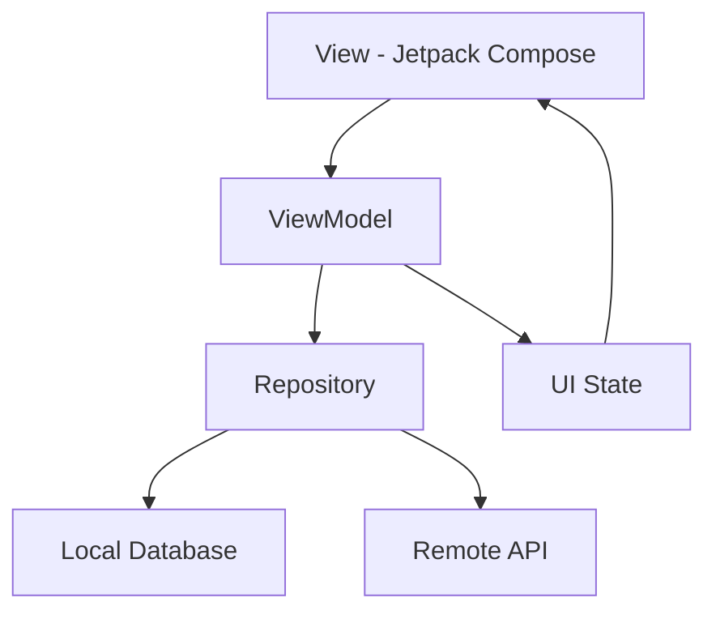
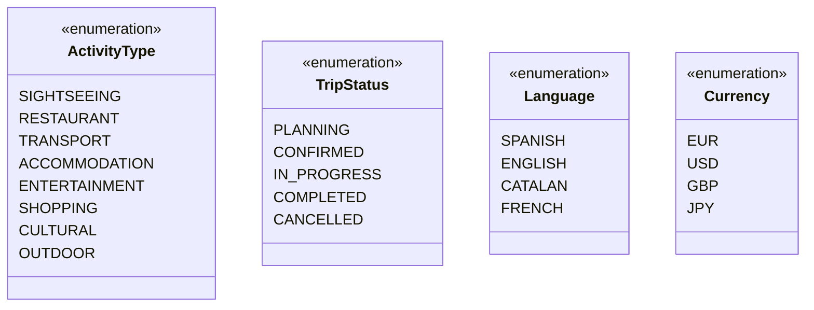
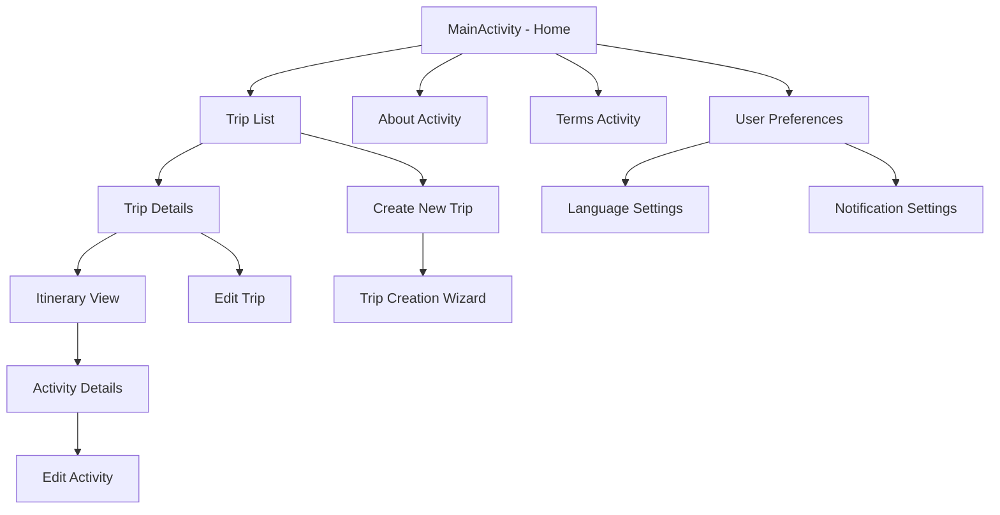

# Travel Planner - Documentación de Arquitectura

## Índice
1. [Visión General](#visión-general)
2. [Arquitectura del Sistema](#arquitectura-del-sistema)
3. [Estructura del Proyecto](#estructura-del-proyecto)
4. [Patrones de Diseño](#patrones-de-diseño)
5. [Tecnologías Utilizadas](#tecnologías-utilizadas)
6. [Modelo de Datos](#modelo-de-datos)
7. [Flujo de Navegación](#flujo-de-navegación)
8. [Consideraciones de Rendimiento](#consideraciones-de-rendimiento)

## Visión General

Travel Planner es una aplicación móvil Android nativa desarrollada en Kotlin que permite a los usuarios planificar viajes, gestionar itinerarios y configurar preferencias personalizadas. La aplicación está diseñada siguiendo los principios de Material Design 3 y utiliza Jetpack Compose para la interfaz de usuario.

## Arquitectura del Sistema

### Patrón Arquitectónico Principal: MVVM (Model-View-ViewModel)

La aplicación sigue el patrón MVVM recomendado por Google para aplicaciones Android:



### Componentes de la Arquitectura

1. **View (Jetpack Compose)**: Interfaz de usuario declarativa
2. **ViewModel**: Gestión del estado de la UI y lógica de presentación
3. **Repository**: Abstracción de las fuentes de datos
4. **Data Layer**: Base de datos local y servicios remotos

## Estructura del Proyecto

```
app/
├── src/main/
│   ├── AndroidManifest.xml          # Configuración de la aplicación
│   ├── java/com/tempestgf/tps/      # Código fuente principal
│   │   ├── MainActivity.kt          # Actividad principal
│   │   ├── AboutActivity.kt         # Pantalla "Acerca de"
│   │   ├── TermsActivity.kt         # Términos y condiciones
│   │   ├── ui/theme/                # Configuración del tema
│   │   │   ├── Color.kt            # Paleta de colores
│   │   │   ├── Theme.kt            # Tema de la aplicación
│   │   │   └── Type.kt             # Tipografía
│   │   ├── data/                   # Capa de datos (futura)
│   │   ├── domain/                 # Lógica de negocio (futura)
│   │   └── presentation/           # ViewModels y UI (futuro)
│   └── res/                        # Recursos de la aplicación
├── build.gradle.kts                # Configuración de build del módulo
docs/
└── design.md                       # Este documento
gradle/
├── libs.versions.toml              # Catálogo de versiones de dependencias
└── wrapper/                        # Gradle Wrapper
```

### Descripción de Archivos Principales

#### Módulo App (`app/`)

- **`MainActivity.kt`**: Punto de entrada principal de la aplicación. Configura Jetpack Compose y define la pantalla inicial con navegación a las pantallas About y Terms.
- **`AboutActivity.kt`**: Pantalla de información sobre la aplicación, incluyendo versión y detalles del desarrollador.
- **`TermsActivity.kt`**: Pantalla de términos y condiciones de uso de la aplicación.

#### Configuración del Tema (`ui/theme/`)

- **`Color.kt`**: Define la paleta de colores de Material Design 3 con soporte para modo claro y oscuro
- **`Theme.kt`**: Configura el tema principal de la aplicación utilizando Material3
- **`Type.kt`**: Define la tipografía utilizada en toda la aplicación

#### Configuración de Build

- **`build.gradle.kts`**: Configuración de Gradle con Kotlin DSL, define dependencias de Jetpack Compose y configuraciones de compilación
- **`libs.versions.toml`**: Catálogo centralizado de versiones de dependencias para mejor gestión y mantenimiento

## Patrones de Diseño

### 1. Single Activity Pattern
La aplicación utiliza múltiples actividades (`MainActivity`, `AboutActivity`, `TermsActivity`) pero está preparada para migrar a una sola actividad con navegación basada en Compose Navigation en el futuro.

### 2. Composition over Inheritance
Jetpack Compose fomenta la composición de funciones (`@Composable`) para crear interfaces reutilizables y modulares.

### 3. Unidirectional Data Flow
Los datos fluyen en una sola dirección: desde los ViewModels hacia las vistas, siguiendo las mejores prácticas de Android.

### 4. Separation of Concerns
Separación clara entre capas: UI, lógica de presentación, dominio y datos.

## Tecnologías Utilizadas

### Core Technologies
- **Kotlin**: Lenguaje de programación principal
- **Android SDK**: Plataforma de desarrollo (minSdk: 31, targetSdk: 35)
- **Gradle with Kotlin DSL**: Sistema de build moderno

### UI Framework
- **Jetpack Compose**: Framework declarativo para UI moderna
- **Material Design 3**: Sistema de diseño más reciente de Google
- **Compose BOM (2024.04.01)**: Gestión de versiones de Compose
- **ConstraintLayout**: Layout avanzado para interfaces complejas

### Architecture Components
- **Lifecycle Runtime KTX**: Gestión del ciclo de vida
- **Activity Compose**: Integración de actividades con Compose
- **Core KTX**: Extensiones de Kotlin para Android

### Testing Framework
- **JUnit 4**: Testing unitario
- **Espresso**: Testing de UI instrumental
- **Compose Testing**: Testing específico para interfaces Compose

## Modelo de Datos

### Entidades Principales

```mermaid
classDiagram
    class Trip {
        +String id
        +String name
        +Date startDate
        +Date endDate
        +String description
        +TripStatus status
        +List~String~ imageUrls
        +Double budget
        +String destination
    }
    
    class Itinerary {
        +String id
        +String tripId
        +Date date
        +List~Activity~ activities
        +String notes
        +Boolean isCompleted
    }
    
    class Activity {
        +String id
        +String title
        +String location
        +Time startTime
        +Time endTime
        +ActivityType type
        +String description
        +Double cost
        +String address
        +Boolean isBooked
    }
    
    class UserPreferences {
        +String userId
        +Language preferredLanguage
        +Currency preferredCurrency
        +List~ActivityType~ interests
        +NotificationSettings notifications
        +Boolean darkModeEnabled
    }
    
    Trip ||--o{ Itinerary : contains
    Itinerary ||--o{ Activity : includes
    Trip }o--|| UserPreferences : configured_by
```

### Tipos de Datos Auxiliares



## Flujo de Navegación



## Consideraciones de Rendimiento

### 1. Lazy Loading
- Implementación de `LazyColumn` para listas grandes de viajes
- Paginación en el cargado de actividades para optimizar memoria
- Carga bajo demanda de imágenes de alta resolución

### 2. State Management
- Uso de `remember` y `mutableStateOf` para gestión eficiente del estado local
- `LaunchedEffect` para operaciones asíncronas sin bloquear la UI
- `derivedStateOf` para cálculos basados en otros estados

### 3. Composition Optimization
- Uso de `@Stable` y `@Immutable` para optimizar recomposiciones
- Implementación de `key` en listas dinámicas
- Evitar creación innecesaria de lambdas en composables

### 4. Memory Management
- Evitar memory leaks en ViewModels mediante `viewModelScope`
- Gestión adecuada del ciclo de vida de las composables
- Limpieza de recursos en `DisposableEffect`

### 5. Build Optimization
- Uso de ProGuard en builds de release para optimización de código
- Configuración de `isMinifyEnabled = false` en debug para desarrollo rápido

## Arquitectura de Futuras Funcionalidades

### 1. Implementación de Repository Pattern
```kotlin
interface TripRepository {
    suspend fun getAllTrips(): Flow<List<Trip>>
    suspend fun getTripById(id: String): Trip?
    suspend fun saveTrip(trip: Trip)
    suspend fun deleteTrip(id: String)
    suspend fun searchTrips(query: String): List<Trip>
}
```

### 2. Dependency Injection con Hilt
- Configuración de módulos de inyección de dependencias
- Gestión del ciclo de vida de objetos
- Inyección en ViewModels y Repositories

### 3. Base de Datos Local con Room
- Definición de entidades, DAOs y base de datos
- Migración de esquemas automática
- Relaciones entre entidades

### 4. Networking con Retrofit
- Sincronización con servicios web de viajes
- Manejo de estados de red (offline/online)
- Cache de datos para funcionamiento offline

### 5. Testing Strategy
- Unit tests para ViewModels y repositories
- Integration tests para base de datos
- UI tests con Compose Testing
- Screenshot testing para regresión visual

---

*Documento actualizado: Mayo 2025*  
*Versión: 1.0*  
*Proyecto: Travel Planner Scaffolding (TPS)*
